# KiraLah

<p align="center">
  <a href="https://github.com/rajaiqbalalauddin/KiraLah/releases/latest/download/KiraLah.apk"></a>
</p>
<p align="center">
  <a href="https://github.com/rajaiqbalalauddin/KiraLah/releases/latest"></a>
  
  <a href="https://github.com/rajaiqbalalauddin/KiraLah/releases"></a>
</p>
<p align="center"><b>Tap Download APK on your Android phone.</b> New to installing APKs? See <a href="#install-on-your-phone">the install steps</a>.</p>

<table>
  <tr>
    <td align="center">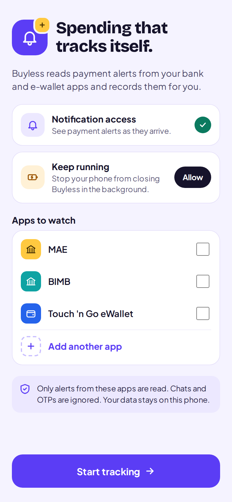<br><sub>Setup</sub></td>
    <td align="center">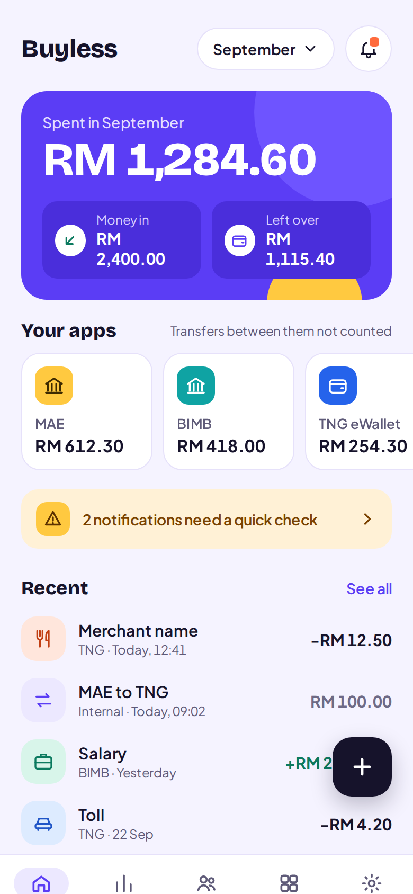<br><sub>Home</sub></td>
    <td align="center">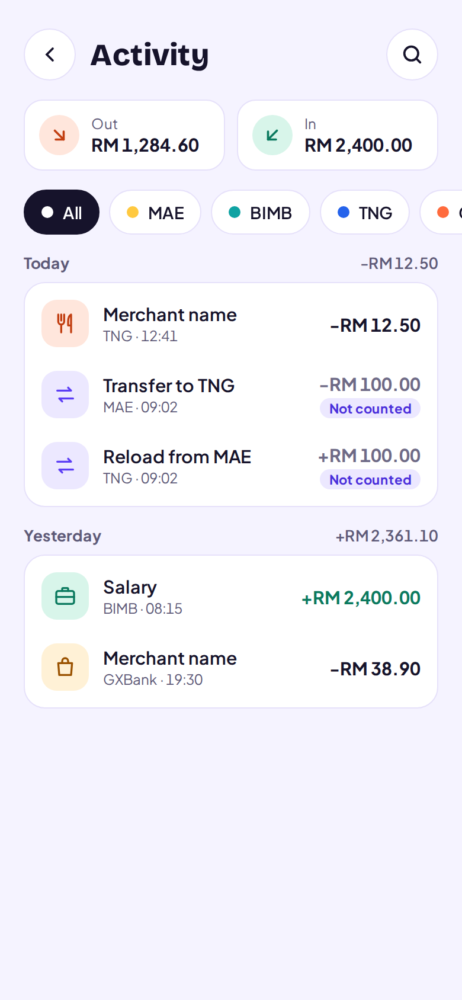<br><sub>Activity</sub></td>
    <td align="center">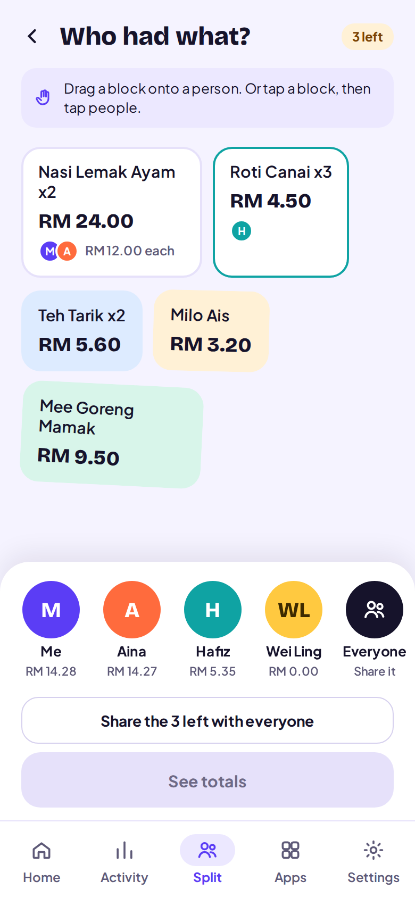<br><sub>Split: who had what</sub></td>
  </tr>
  <tr>
    <td align="center">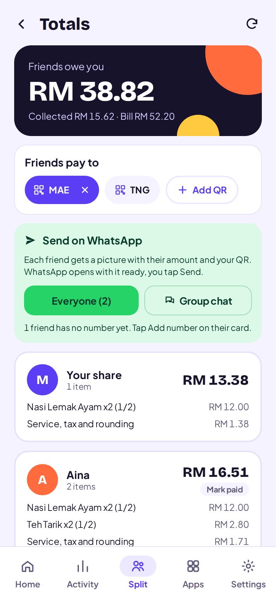<br><sub>Split: totals</sub></td>
    <td align="center">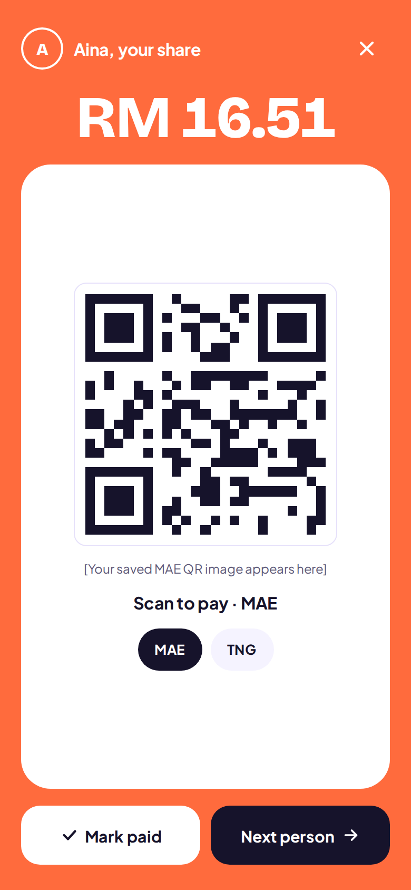<br><sub>Show QR</sub></td>
    <td align="center">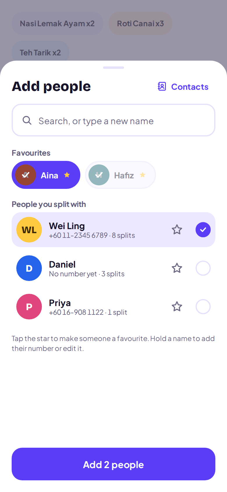<br><sub>Add people</sub></td>
    <td align="center">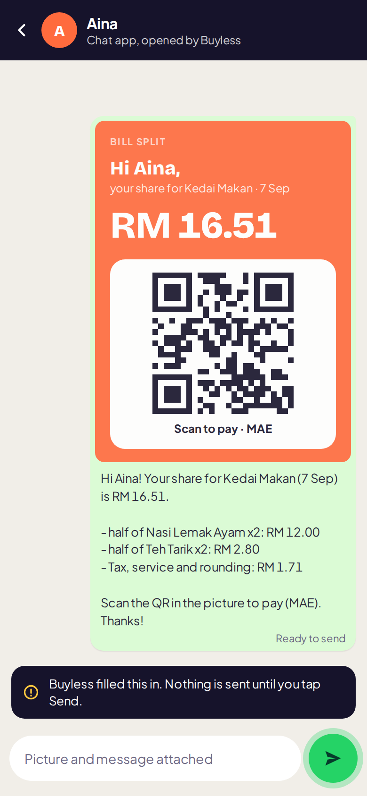<br><sub>Sent on WhatsApp</sub></td>
  </tr>
</table>

<sub>Screens from the design mockups.</sub>

An Android app that records your spending automatically. It reads payment notifications from bank and
e-wallet apps (MAE, Bank Islam, Touch 'n Go, plus any app you add), works out the amount and direction,
and keeps everything on your phone.

KiraLah was called Buyless early on, so the code still lives in the `com.buyless.app` package.

## Download

> [!IMPORTANT]
> **[Download the latest KiraLah APK](https://github.com/rajaiqbalalauddin/KiraLah/releases/latest/download/KiraLah.apk)** (version 1.1.0, about 80 MB). Every version is on the
> [Releases page](https://github.com/rajaiqbalalauddin/KiraLah/releases).

KiraLah is not on the Play Store, so Android installs it as an app "from an unknown source". That is normal
for an APK from GitHub.

### Install on your phone

1. On the phone, open the download link above in Chrome and download the APK (about 80 MB).
2. Tap the downloaded file (or open it from **Files > Downloads**).
3. If Android says Chrome is not allowed to install apps, tap **Settings**, turn on **Allow from this source**,
   then go back and tap **Install**.
4. If Play Protect warns that it does not recognise the app, tap **More details > Install anyway**. It warns
   about every app that is not from the Play Store.
5. Open KiraLah and follow Setup. When you turn on **Notification access** and the switch is greyed out, open
   **Settings > Apps > KiraLah**, tap the three-dot menu, choose **Allow restricted settings**, and try again.
6. Allow notifications when asked. Spending limit reminders need them.

### Update to a new version

Download the newer APK and install it over the old one. Your transactions, limits and splits stay, because
everything is stored on the phone. Do not uninstall first, as that deletes your data.

### Good to know

- Needs Android 8.0 or newer.
- The public APK has no Gemini key built in, so Split reads receipts on the phone with ML Kit. It works
  offline, but it is less accurate on messy receipts than the Gemini reader in a build with your own key.

## Run it

1. Open this folder in Android Studio (Ladybug or newer).
2. Let Gradle sync. It downloads Gradle 8.11.1, AGP 8.7.3 and the libraries on the first run.
3. Plug in your phone with USB debugging on, then press Run.
4. In the app, turn on **Notification access**. If the switch is greyed out (Android 13+ with a sideloaded
   APK), open App info, tap the three-dot menu, then **Allow restricted settings**, and try again.

Run the parser tests with `./gradlew test`.

## How it works

```
Notification posted
   -> PaymentListenerService      (ignores anything not from a watched app, O(1) lookup)
   -> NotificationParser          (amount, in/out, merchant, category; drops OTPs and promos)
   -> trusted app + clear parse?  yes -> saved automatically
                                  no  -> Quick check queue
   -> TransactionRepository       (Room; de-duplication, transfer matching)
   -> Compose UI                  (Home, Activity, Apps, Settings, Quick check)
```

**Bank templates.** Bank Islam (BIMB) alerts are read with exact templates built from real alerts:
QR / FPX payments, QR transfers, card alerts in English and Malay, and DuitNow money received. These
are recorded straight away with the time printed in the alert (card alerts can arrive late). A card
charge in a foreign currency (USD etc.) goes to Quick check, because the ringgit amount is not known yet.
Promotions and updates are ignored. Templates live in `parser/BankProfiles.kt`.

**Notification samples (listen first).** MAE, TNG and other apps have no templates yet. KiraLah keeps
the last 300 alerts from watched apps (never OTP / TAC) under Settings > Notification samples. Share the
ones marked "Not recognised" (long numbers are masked) and turn them into a new profile in `BankProfiles`.

**Learning.** Every app starts in learning mode. Its alerts go to Quick check with the parser's guess
pre-filled. After 3 guesses you save without changes, that app is recorded automatically. Change
`LEARNING_THRESHOLD` in `data/model/Models.kt` to adjust this.

**App balances.** Tap an app tile on Home and type what that app shows right now. KiraLah stores it as a
starting point (no transaction is created) and keeps the balance live from alerts after that moment.
Transfers between your own apps do move balances, even though they are not counted as spending.
Tap the eye next to the total to hide every balance (shown as RM ••••). The choice is remembered
after the app closes. Spending totals stay visible.

**Tabs.** The five tabs sit in one `HorizontalPager` inside the `home` destination (`ui/nav/BuylessNavHost.kt`),
so tapping a tab slides to it and you can swipe between them. Swipes that start on a transaction row still
delete it. Tapping the tab you are already on resets it: Home and Activity go back to this month and the top
(Activity also clears search and the app filter), Recap and Settings scroll up, and Split returns to the scan
screen, asking first if a split is not finished yet.

**Custom categories.** In the editor, the category row has a "New" chip. It opens a sheet to name the category,
pick one of 10 colours and one of about 220 icons (grouped, with search: "kopi", "petrol", "kucing" all work). Hold a
custom chip to edit or delete it; Settings > Categories lists them all. They live in the `custom_categories` table
(migration 6 to 7). A transaction points at one by storing `custom:<id>` in its category column, next to built-in
names like `FOOD`, so totals, the parser and older rows did not change (`CategoryKeys` in `data/model/Models.kt`).
Deleting a category moves its transactions to Other (or Income for money in). Icons are saved by name, never by
position, so the icon list in `ui/categories/CategoryIcons.kt` can grow safely. The notification parser still only
guesses built-in categories.

**Night mode.** Settings > Night mode: System, Light or Dark. Every `BColors` token reads the live palette
(`ui/theme/Theme.kt`), so the whole app switches at once without screens knowing about it. `Surface` is the card
colour (white by day), `OnColor` is always white for text on strong fills, and `Night` is always dark for surfaces
that should stay dark (Recap cards, the receipt viewer). The WhatsApp pay card picture always stays light.

**Activity charts.** Under the app chips, a Spending card shows a bar per day of the month or a bar per month for
the last six (Days | Months toggle); tap a bar for its exact amount. "Where it went" lists the top five categories
(the rest fold into Other). Both follow the app chip, not the search box. Built in `ActivityViewModel.buildCharts`
from one six-month query and drawn on a Canvas in `ui/activity/SpendCharts.kt`.

**Spending limits.** On the Activity tab, under the Out / In totals, tap **Add**. Pick how often (daily,
weekly or monthly), a category (or all spending) and an amount. Each limit gets a card with a bar for the current
day, week or month, whichever month Activity is showing, and the app filter does not change it. The bar turns
amber at 80% and red once the limit is used up.

<table>
  <tr>
    <td align="center">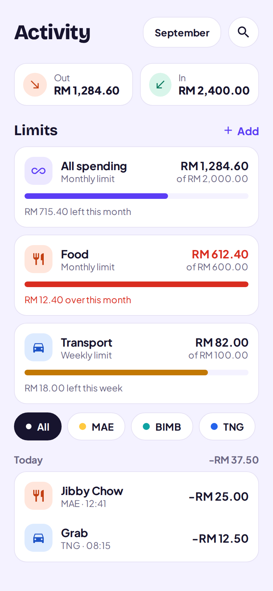<br><sub>Limits on Activity</sub></td>
    <td align="center">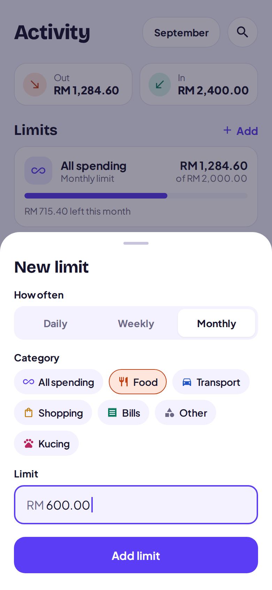<br><sub>Adding a limit</sub></td>
    <td align="center">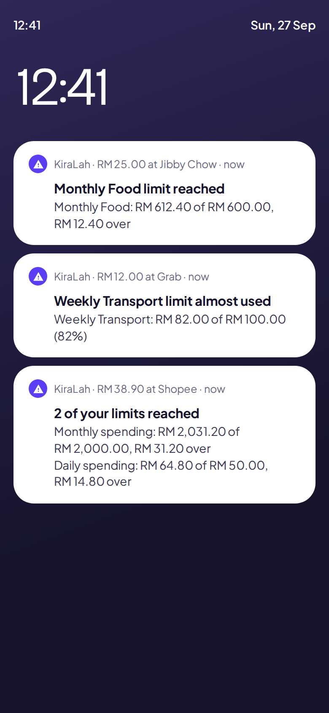<br><sub>Reminders</sub></td>
  </tr>
</table>

- The payment that uses up a limit, and every payment after it in the same period, posts a "limit reached"
  notification. One heads-up is sent when a payment takes a limit past 80%.
- One notification per payment, even when it trips several limits. Limits have their own notification channel,
  so they can be muted on their own in Android settings.
- Weeks run Monday to Sunday. Transfers between your own apps never count, and income cannot have a limit.
- Android 13+ asks for notification permission when the first limit is saved. If notifications are off, the
  Limits section shows a banner to turn them on.
- The rules are in `limits/LimitMath.kt` (unit tested in `LimitCheckerTest`). `limits/LimitAlerts.kt` runs them after
  every new payment out, through a hook in `TransactionRepository`. The UI is `ui/limits/LimitsPanel.kt`. Limits live
  in the `spending_limits` table (migration 7 to 8) and are deleted along with their custom category.

**Month starts on.** Settings > Month starts on lets you pick the day your month begins (1 to 31), for example
payday on the 25th. A month then runs from 25 Sep to 24 Oct and is named after the month it starts in
("September"). Home, Activity (list, totals and both charts), Recap and monthly spending limits all follow it, and
changing the day regroups your history at once, since nothing is stored per month. Recap cards show the range,
a month's story unlocks on the next start day, its "Week 1" begins on the start day, and a year covers the twelve
months that start in it, so the year total always equals its month cards. Days 29 to 31 fall back to the last day
in shorter months (start day 31 means 28 Feb). The date maths is in `util/MonthPeriods.kt`, unit tested in
`MonthPeriodsTest`.

**Removing spending.** Swipe any transaction left in Activity or Recent to delete it, with Undo in the
snackbar. If it was half of a transfer pair, Undo re-links the pair.

**Recap tab.** A Spotify Wrapped style archive: a card per finished month plus one per year. The current month stays locked
until it ends. Tapping one plays a
full-screen story (tap right or left to move, hold to pause): total spent with a count-up, change vs the
previous period, top categories, number one merchant, biggest payment, busiest weekday, top apps, a money
personality, and a shareable summary. Month totals come from one grouped SQL query; transactions are only
loaded when a story plays. The facts are built in `recap/RecapBuilder.kt`, which is unit tested.

**Receipt reading with Gemini.** The Split tab sends the receipt photo (shrunk to 1600 px, around 300 KB)
to Gemini, which returns every item, its quantity, add-ons, modifiers ("Less ice") and the service, tax,
rounding and discount lines as JSON. `gemini-3.5-flash-lite` reads first because it is fastest. If its
items do not add up to the printed total, `gemini-3.8-flash` reads it once more. With no key or no
internet, the on-device ML Kit reader takes over. Model ids are in `split/GeminiReceiptReader.kt`.

Put your key in `local.properties` (git-ignored, so it never reaches GitHub):

```
GEMINI_API_KEY=your-key-here
```

Anyone with the APK can extract a key built into it, so keep this build to yourself, or move the call to
a small server before sharing the app.

**Tax already in the prices.** Many Malaysian receipts print SST even though the menu prices include it
("Total Incl. 6% SST"). `split/ChargeReconciler.kt` tries each way the service charge and tax could
combine with the items (both on top, tax inside, both inside, service inside) and keeps the one that lands
on the printed total within 5 sen. Ties go to the most common layout (charges on top). Gemini's
`pricesIncludeTax` flag only decides when there is no total or nothing adds up. The Charges card shows
"Added on top" or "Already in prices" under each charge, and a tap flips it.

**Split history.** Every split is saved when its totals are first shown, and again whenever someone is
marked paid. Past splits are listed under the scan buttons on the Split tab, with a receipt thumbnail,
the total and how many friends have paid. Tap one to reopen its Totals screen, including the QR cards.
The receipt photo is kept as a private copy (the camera file is temporary) and opens full screen with
pinch to zoom. Swipe a past split left to delete it, with Undo.

**Split tab.** Scan a receipt (camera or gallery), check the items, then hold and drag each item block onto
the person who had it (or onto Everyone to share it). Tapping a block and then tapping people works too.
Service, SST, rounding and discounts are shared by how much each person ordered, and totals always add up
to the bill to the sen. The Totals screen shows a full-screen card per friend with their amount and your
saved payment QR (MAE, TNG, DuitNow...), with "Next person" to pass the phone round the table.

**Friends and the people drawer.** Everyone you add to a bill is saved as a friend automatically
(`friends` table, one row per name ignoring capitals). On the board, "Add" opens a drawer: favourites
as one-tap chips on top, then everyone else ranked by how often you split with them. Tick several and
add them at once, type a new name, or pick from your phone contacts (Android's own picker, so KiraLah
never needs the contacts permission). Star to favourite, hold a name to add a number, edit or forget it.
Friends are filled once from older saved splits when you update.

**WhatsApp.** On Totals, each friend's card has a WhatsApp button. KiraLah draws a picture with their
amount and your payment QR (`share/PayCardRenderer.kt`), writes a short message with their items
(`share/PayMessage.kt`), and opens that friend's chat with both attached. You tap Send. "Everyone" goes
through all friends with a number: the next chat opens when you come back to KiraLah. "Group chat" sends
one summary picture with everyone's amount and who has paid. Numbers like 012-345 6789 are turned into
60123456789 automatically. No WhatsApp API is used, so it is free and sends from your own number.
Opening a specific chat with a picture uses WhatsApp's undocumented `jid` extra; if that ever stops
working, WhatsApp shows its chat picker, and without WhatsApp the normal share sheet opens.

**Transfers between your own apps.** Money going out of one watched app and into another with the same
amount within 10 minutes is paired and left out of totals. You can also tick "Transfer between my own
apps" on any entry; you then have to pick where it went (or came from), and lists show it as "BIMB → TNG".
If that app has no entry of its own, KiraLah adds a stand-in one there (origin `MIRROR`) so its balance
stays right, and that app's real alert replaces the stand-in when it arrives. Cash gets no stand-in.
Logic lives in `TransactionRepository` (migration 8 to 9 adds `counterpartPackage` / `counterpartLabel`).

**Remembered categories.** Under the category chips, choose "This entry only" or "Every <merchant> entry".
The second saves a rule (`category_rules`, per merchant and direction) so new alerts, Quick check guesses
and hand-typed entries from that merchant get that category. Past entries are not changed. Rules are listed
under Settings > Categories > Remembered merchants, where you can forget one.

## Performance choices

| Where | What | Why |
| --- | --- | --- |
| Listener | Watched apps held in an in-memory HashMap | Most notifications are ignored after one lookup |
| Parser | Regexes compiled once | Compiling per notification is the usual hidden cost |
| Database | SUM / GROUP BY in SQL, indexes on time, app, dedup key | Only the totals leave the database |
| Database | Unique dedup key, `INSERT OR IGNORE` | Re-posted notifications never double count |
| Database | WAL journal mode | Listener writes do not block UI reads |
| Icons | LruCache of decoded bitmaps, capped at 1/32 of heap | No decoding twice while scrolling |
| App scan | PackageManager scan cached per process | The Apps screen opens instantly the second time |
| Money | Stored as `Long` sen | Exact totals, no floating-point drift |
| UI | `@Immutable` models, list keys, formatting in ViewModels | Compose skips unchanged rows |
| UI | `WhileSubscribed(5s)` + `collectAsStateWithLifecycle` | Queries stop when the app is in the background |
| Split | One ML Kit recognizer reused per process | The model loads once, later scans are faster |
| Split | Drag bounds in plain maps, only pointer is observable state | Dragging recomposes the ghost block, not the board |
| Split | QR images downscaled to 1200 px PNG on import, bitmaps cached | Instant QR switching, small memory use |
| Release | R8 minify and resource shrinking | Small APK, unused icons stripped |

## Tuning the parser

`parser/NotificationParser.kt` uses keywords, not exact templates, so wording changes do not break it
silently. When an alert is parsed wrongly, copy its text from Quick check into
`NotificationParserTest.kt` as a new test, adjust the keyword lists, and run the tests.

## Project layout

```
app/src/main/java/com/buyless/app/
  AppContainer.kt          manual dependency injection + Application class
  MainActivity.kt
  data/db/                 Room entities, DAOs, database
  data/repo/               TransactionRepository, AppsRepository (installed apps + icon cache)
  data/model/              enums and TransactionDraft
  parser/                  NotificationParser
  service/                 PaymentListenerService
  limits/                  spending limit rules (LimitMath), alerts and notifications
  split/                   ReceiptParser, SplitMath (pure Kotlin, unit tested), ReceiptScanner (ML Kit)
  ui/                      theme, shared components, one package per screen, navigation
  util/                    Money and date formatting, known Malaysian apps, system settings shortcuts
```

## Versions

**1.0.0** (27 Sep 2026)

- Month starts on: budget from any day of the month, such as payday. Home, Activity, Recap and monthly
  limits all follow it.
- Spending limits on the Activity tab: daily, weekly or monthly, for one category or everything, with a
  reminder on each payment once a limit is used up and a heads-up at 80%.
- Custom categories with your own name, colour and icon.
- Night mode, Activity charts, Recap stories, and swipe to delete with Undo.
- Split: receipt reading, drag items onto people, pay cards with your QR sent over WhatsApp, and split history.
- Automatic tracking from bank and e-wallet notifications, with exact templates for Bank Islam.
- Fix: the Keep running step no longer keeps showing Allow after it has been allowed.

### Publishing a release

1. Bump `versionCode` (by 1) and `versionName` in `app/build.gradle.kts`.
2. Build the public APK without your Gemini key: `.\gradlew assembleDebug -PpublicBuild`
3. Rename `app/build/outputs/apk/debug/app-debug.apk` to `KiraLah.apk`. Keep this exact name every time: the
   Download button points at `releases/latest/download/KiraLah.apk`, so it always serves the newest release.
4. On GitHub, open **Releases > Draft a new release**, create the tag `v<version>`, attach the APK, and publish.
5. Add the release to this list. The version badge at the top updates itself.

The APK is signed with the debug key on your PC. Always build releases on the same PC, or phones will refuse to
install the update over the old version.

## Not done yet

- Custom fonts. The design uses Bricolage Grotesque and Plus Jakarta Sans. Add the `.ttf` files to
  `res/font` and swap the two `FontFamily` values in `ui/theme/Theme.kt`.
- Limit progress on Home, and a home screen widget (listed as open in the design brief).
- Backup and export. Data is local only, and `allowBackup` is off on purpose.
